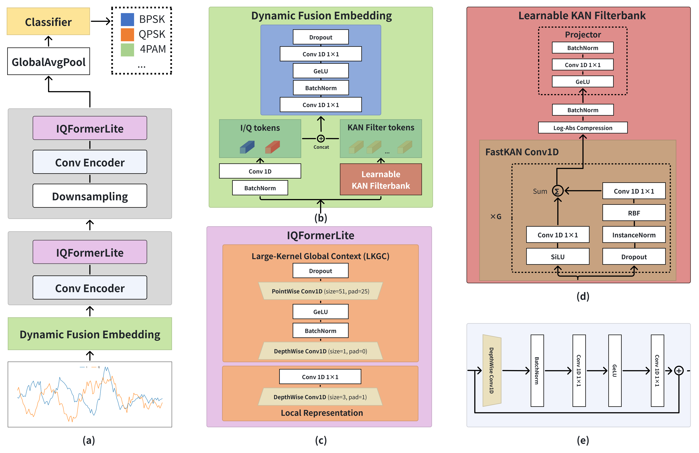
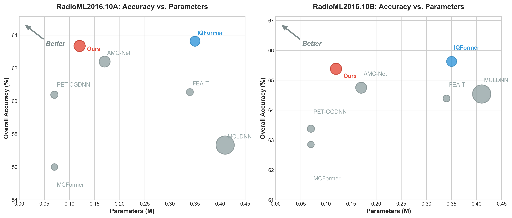
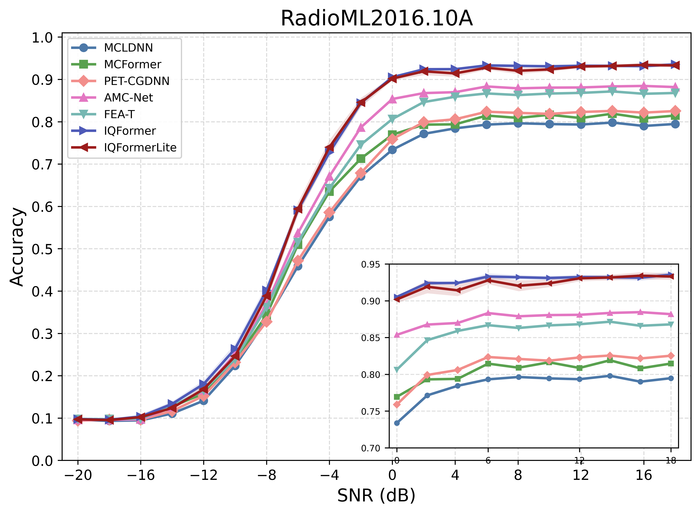
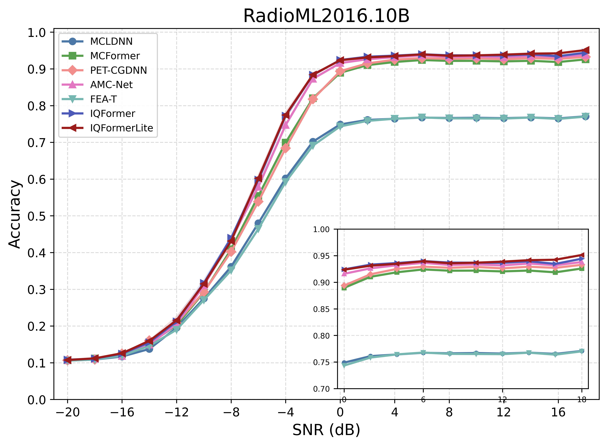
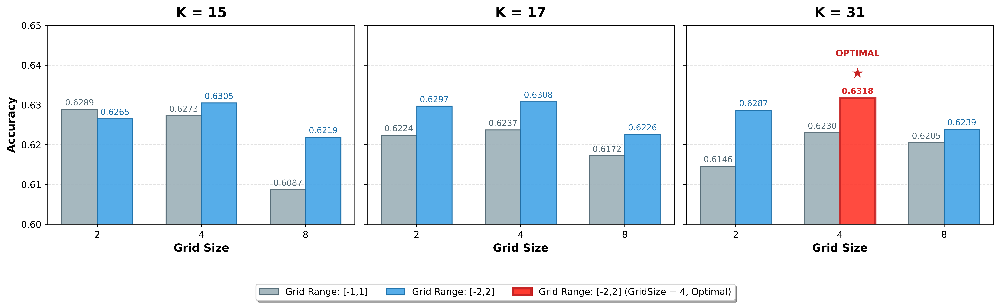
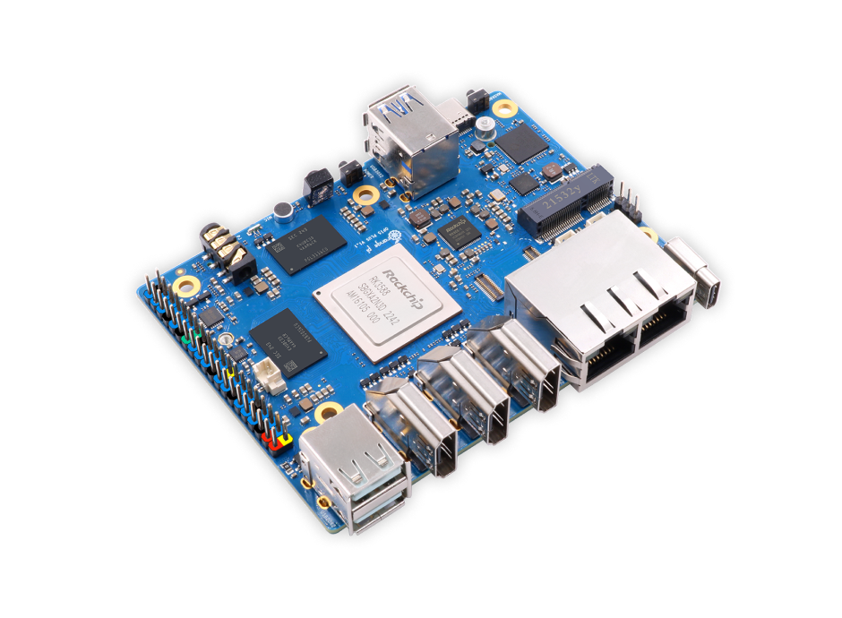

# 📡 IQFormerLite

> A PyTorch implementation of **IQFormerLite**, a hardware-efficient automatic modulation classification (AMC) framework for radio IQ signals.


📘 Chinese version: [README_CN.md](README_CN.md)

📄 Paper: [IQFormerLite: A hardware-efficient framework for automatic modulation recognition](https://ftp.nowpublishers.com/ijicc/article-abstract/doi/10.1108/IJICC-02-2026-0175/1397768/IQFormerLite-a-hardware-efficient-framework-for?redirectedFrom=fulltext)<br>
DOI: [10.1108/IJICC-02-2026-0175](https://doi.org/10.1108/IJICC-02-2026-0175)

---

## 🧠 From raw IQ signals to edge inference

IQFormerLite processes raw I/Q sequences with a Dynamic Fusion Embedding module, a Learnable KAN Filterbank (LKF), and large-kernel convolutional encoder blocks. The design keeps long-range context modeling and adaptive spectral extraction while replacing recurrent and attention-heavy paths with operators that are easier to compile for edge NPUs.



The result is a compact AMC backbone for real-time experiments on RadioML2016.10A and RadioML2016.10B. The paper evaluates both recognition quality and deployment efficiency, rather than treating parameter count alone as the definition of “lightweight.”

## 📈 Why IQFormerLite is lightweight

The parameter–accuracy comparison below shows the intended operating point: IQFormerLite stays close to IQFormer in recognition accuracy while using substantially fewer parameters on both datasets.



| Dataset | IQFormerLite overall accuracy | Parameters | FLOPs |
|---|---:|---:|---:|
| RadioML2016.10A | 63.18 ± 0.22% | 0.13 M | 32.06 M |
| RadioML2016.10B | 65.51 ± 0.13% | 0.13 M | 32.06 M |

Compared with IQFormer, the proposed model reduces the parameter count from approximately 0.35 M to 0.13 M, a reduction of about 63.8%, while retaining competitive overall accuracy.

---

## ✨ Highlights

- Lightweight IQFormerLite backbone for real-time AMC experiments.
- Supports IQ-only, STFT fusion, convolutional filter-bank features, and KAN/LKF-based filtering.
- Training and evaluation support for RML2016.10a and RML2016.10b.
- Includes IQFormer, MCFormer, AMCNet, MCLDNN, PET-CGDNN, FEA-T128, and FEA-T1024 baselines.
- Provides scripts for seed sweeps, LKF ablations, kernel sweeps, result summaries, and figure generation.

The SNR-dependent curves below show where the compact design preserves performance: accuracy rises sharply through the transition region and approaches the stronger baselines at moderate and high SNR.

| RadioML2016.10A | RadioML2016.10B |
|---|---|
|  |  |

---

## 🧭 Repository Layout

```text
.
|-- main.py                         # Main train/val/test entry point
|-- train.sh                        # Example batch training script
|-- dataset/                        # RadioML loaders and dataset utilities
|-- model/                          # IQFormerLite and baseline models
|-- utils/                          # Training loops, reports, plots, helpers
|-- scripts/                        # Experiment and summary scripts
|-- notebook/                       # Analysis and plotting utilities
|-- assets/paper/                   # Paper figures embedded in this README
|-- logs/                           # Runtime logs, TensorBoard, confusion matrices, t-SNE
|-- save_models/                    # Trained checkpoints
`-- rknn/                           # Edge/NPU deployment assets
```

> ⚠️ `logs/`, `save_models/`, TensorBoard event files, and local experiment outputs can be very large.
> Local-only directories such as `results/`, `paper/`, and `.trae/` are intentionally excluded from Gitee synchronization.

---

## 🛠️ Environment

The code is implemented with PyTorch. Use a CUDA-enabled PyTorch build for GPU training.

### Core dependencies

- Python 3.9+
- PyTorch
- numpy
- pandas
- scipy
- scikit-learn
- matplotlib
- seaborn
- h5py
- tensorboardX
- tqdm
- timm

### Example setup

```bash
conda create -n iqformerlite python=3.11 -y
conda activate iqformerlite

# Install PyTorch according to your CUDA/driver stack first.
pip install torch torchvision torchaudio

# Install common utilities.
pip install numpy pandas scipy scikit-learn matplotlib seaborn h5py tensorboardX tqdm timm
```

---

## 📦 Dataset Preparation

Experiments use the DeepSig RadioML 2016 datasets:

- `RML2016.10a.pkl`
- `RML2016.10b.dat`

Place them under `dataset/`:

```text
dataset/
|-- RML2016.10a.pkl
`-- RML2016.10b.dat
```

You can also use a custom path with `--database_path`.

Supported dataset choices:

- `2016.10a`
- `2016.10b`

---

## 🚀 Quick Start

### 1. Smoke test

Run a short dry run before launching a full training job.

```bash
cd /Users/chenww/develop/IQFormerLite/code

python main.py \
  --database_path ./dataset \
  --database_choose 2016.10a \
  --model IQFormerLite \
  --aux_mode kan \
  --kernel_size 31 \
  --grid_size 4 \
  --grid_range -2 2 \
  --batch_size 1024 \
  --num_epochs 1 \
  --dry_run \
  --comment IQFormerLite_dry_run
```

### 2. Train IQFormerLite

```bash
python main.py \
  --database_path ./dataset \
  --database_choose 2016.10a \
  --model IQFormerLite \
  --aux_mode kan \
  --kernel_size 31 \
  --grid_size 4 \
  --grid_range -2 2 \
  --batch_size 1024 \
  --num_epochs 100 \
  --seed 1234 \
  --comment IQFormerLite_seed1234
```

### 3. Run the example script

Edit `DATABASE_PATH`, `DATABASE_CHOOSE`, `CUDA_VISIBLE_DEVICES`, and training settings in `train.sh` before running.

```bash
bash train.sh
```

---

## ⚙️ Main Options

| Option | Description |
|---|---|
| `--database_path` | Dataset directory |
| `--database_choose` | Dataset name: `2016.10a` or `2016.10b` |
| `--model` | Model name |
| `--aux_mode` | Auxiliary feature mode: `none`, `stft`, `conv`, `kan` |
| `--band_k` | Number of frequency bands |
| `--kernel_size` | KAN/LKF filter kernel size |
| `--grid_size` | KAN grid size |
| `--grid_range` | KAN grid range, e.g. `-2 2` |
| `--lkf_variant` | LKF ablation variant |
| `--batch_size` | Training batch size |
| `--eval_batch_size` | Validation/test batch size |
| `--num_epochs` | Maximum training epochs |
| `--lr` | Learning rate |
| `--seed` | Random seed |
| `--model_path` | Optional checkpoint path |
| `--dry_run` | Run a small subset for verification |
| `--report_only` | Generate model report and exit |
| `--skip_post_test_artifacts` | Skip confusion matrices and t-SNE after `Test_ACC.csv` |

Supported models:

```text
IQFormerLite, IQFormer, MCFormer, AMCNET, MCLDNN, PETCGDNN, FEA_T128, FEA_T1024
```

Recommended IQFormerLite configuration:

```text
--model IQFormerLite --aux_mode kan --kernel_size 31 --grid_size 4 --grid_range -2 2
```

These LKF settings are not arbitrary defaults: the grid-size and grid-range sweep identifies `grid_size=4`, `grid_range=[-2, 2]`, and `kernel_size=31` as the selected configuration for the reported model.



---

## 📊 Outputs

Each run creates a tag:

```text
model_<dataset>_<epochs>_<batch_size>_<lr>_<comment>
```

Runtime artifacts:

```text
logs/<run_tag>/
|-- Train_Epoch.csv                 # Per-SNR training accuracy by epoch
|-- Val_Epoch.csv                   # Per-SNR validation accuracy by epoch
|-- Test_ACC.csv                    # Per-SNR test accuracy and Avg row
|-- Test_mod_SNR.csv                # Modulation-wise accuracy by SNR
|-- model_report.txt                # Model complexity/report text
|-- confusionMatrix/                # Confusion matrices
`-- tsne/                           # t-SNE visualizations
```

Best checkpoint:

```text
save_models/<run_tag>/weight.pt
```

> ✅ `Test_ACC.csv` is the primary file used by summary scripts.

---

## 🚀 Edge deployment

The deployment target is the Rockchip RK3588 NPU on Orange Pi 5 Plus. This hardware-oriented path is part of the model’s design objective: the benchmark measures compiled-model latency, throughput, memory, NPU load, and quantized accuracy in addition to PyTorch accuracy.



Under the evaluated INT8 RKNN protocol, IQFormerLite reaches **0.157 ms/sample** latency and **6,387.84 samples/s** throughput, with **63.11%** aligned RKNN validation accuracy.

---

## 🧾 Model Report

`main.py` writes a model report before training:

```text
logs/<run_tag>/model_report.txt
```

Generate report only:

```bash
python main.py \
  --database_path ./dataset \
  --database_choose 2016.10a \
  --model IQFormerLite \
  --aux_mode kan \
  --report_only \
  --comment IQFormerLite_report
```

---

## 📌 Practical Workflow

1. **Prepare data**  
   Put `RML2016.10a.pkl` and/or `RML2016.10b.dat` under `dataset/`.

2. **Run dry run**  
   Use `--dry_run` to confirm the environment, model, and dataset path.

3. **Train model**  
   Run `main.py` or one of the scripts under `scripts/`.

4. **Check results**  
   Start from `logs/<run_tag>/Test_ACC.csv` and `model_report.txt`.

5. **Summarize results**  
   Use the corresponding `scripts/summarize_*.py` script.

---

## 📄 License

The project-level license is provided in `LICENSE`. Third-party datasets, libraries, model implementations, and deployment toolchains may have separate licenses and usage terms.
