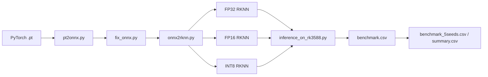

# RKNN Deployment and Benchmark Guide

> RKNN conversion, on-device inference, and repeated benchmarking for `IQFormerLite` / `IQFormer` on Rockchip NPUs, with RK3588 as the primary target.

## ✨ What This README Covers

- Locate the RKNN entry points for `IQFormerLite` and `IQFormer`
- Recreate the current `conda` environment and RKNN Runtime setup
- Run quickstart inference, single-model benchmarking, and five-seed summaries
- Understand the full `PT -> ONNX -> RKNN -> on-board benchmark` workflow

## 🗺️ Workflow Overview



## 📁 Directory Layout

```text
rknn/
├── README.md
├── README_CN.md
├── environment.yml                   # Full conda environment export
├── environment-min.yml               # Minimal conda environment export
├── env_rknn_runtime_2.3.2.sh          # RKNN Runtime library setup
├── rknn-explicit.txt                 # Explicit package list for strict same-platform reproduction
├── run_benchmark_5seeds.py            # Unified five-seed benchmark runner
├── runtime/
│   └── lib/
│       └── librknnrt.so
├── rknn_IQFormerLite/
│   ├── inference_on_rk3588.py
│   ├── inference_on_rk3588.sh
│   ├── benchmark.csv
│   ├── benchmark_5seeds.csv
│   ├── benchmark_5seeds_summary.csv
│   ├── calib/
│   │   └── dataset.txt
│   ├── pt2rknn/
│   │   ├── pt2onnx.py
│   │   ├── fix_onnx.py
│   │   ├── onnx2rknn.py
│   │   └── run_convert.sh
│   └── weights/
│       ├── IQFormerLite.pt
│       ├── weight_fp32.rknn
│       ├── weight_fp16.rknn
│       └── weight_int8.rknn
└── rknn_IQFormer/
    ├── inference_on_rk3588.py
    ├── inference_on_rk3588.sh
    ├── benchmark.csv
    ├── benchmark_5seeds.csv
    ├── benchmark_5seeds_summary.csv
    ├── calib/
    │   └── dataset.txt
    ├── pt2rknn/
    │   ├── pt2onnx.py
    │   ├── fix_onnx.py
    │   ├── onnx2rknn.py
    │   └── run_convert.sh
    └── weights/
        └── IQFormer/
            ├── IQFormer_fp32.rknn
            ├── IQFormer_fp16.rknn
            └── IQFormer_int8.rknn
```

## 🧪 Environment Versions

The following versions are based on the current `rknn` conda environment and the runtime files included in this directory.

| Component | Version | Notes |
| --- | --- | --- |
| Conda env | `rknn` | Shared environment for RKNN inference and conversion scripts |
| Python | `3.10.20` | From `conda-meta/history` |
| RKNN Runtime | `2.3.2` | Matches `env_rknn_runtime_2.3.2.sh` and `runtime/lib/librknnrt.so` |
| `rknn_toolkit_lite2` | `2.3.2` | Required by on-board inference scripts |
| `numpy` | `2.2.6` | Evaluation and data processing |
| `psutil` | `7.2.2` | Process memory profiling |
| `torch` | `2.12.1+cu130` | CPU-side complexity checks, reference inference, and ONNX export |
| `einops` | `0.8.2` | Model dependency |
| `timm` | `1.0.27` | Model dependency |

> Notes
>
> - On-board inference depends on `rknn_toolkit_lite2==2.3.2`.
> - The `PT/ONNX -> RKNN` conversion scripts depend on `rknn_toolkit2` through `from rknn.api import RKNN`; use version `2.3.2` to match Runtime/Lite2.
> - For reproduction on another board, keep `RKNN Runtime`, `rknn_toolkit_lite2`, and `rknn_toolkit2` on compatible versions.

## ♻️ Environment Reproduction

This directory provides three environment reproduction options.

### Option 1: Full Environment File

Recommended for most users.

```bash
cd /home/orangepi/IQFormerLite
conda env create -f /home/orangepi/IQFormerLite/rknn/environment.yml
conda activate rknn
source /home/orangepi/IQFormerLite/rknn/env_rknn_runtime_2.3.2.sh
```

### Option 2: Minimal Environment File

Use this when you want a smaller environment and prefer to install RKNN packages manually.

```bash
cd /home/orangepi/IQFormerLite
conda env create -f /home/orangepi/IQFormerLite/rknn/environment-min.yml
conda activate rknn
```

### Option 3: Explicit Package List

Use this for strict same-platform reproduction. It usually requires the same OS and architecture.

```bash
conda create -n rknn --file /home/orangepi/IQFormerLite/rknn/rknn-explicit.txt
conda activate rknn
source /home/orangepi/IQFormerLite/rknn/env_rknn_runtime_2.3.2.sh
```

### Reproduction Notes

- Recommended platform: `Linux aarch64`
- Recommended Python version: `3.10`
- Keep `RKNN Runtime 2.3.2`, `rknn_toolkit_lite2 2.3.2`, and `rknn_toolkit2 2.3.2` aligned when possible
- If the target machine is not the same architecture, start from `environment-min.yml` and install the RKNN dependencies manually
- If local wheels, private packages, or additional `.so` files are required, distribute them together with the environment instructions

### Common Reproduction Pitfalls

- Do not use `rknn-explicit.txt` first if the target machine is not `Linux aarch64`
- On-board inference may fail if the NPU runtime version differs
- `from rknn.api import RKNN` errors usually mean `rknn_toolkit2` is missing from the conversion environment
- `rknn_toolkit_lite2 not found` usually means the `rknn` environment is not active or Lite2 is not installed
- `Missing librknnrt.so` usually means the runtime library path has not been exported

### Quick Checks

```bash
python -c "from rknnlite.api import RKNNLite; print('Lite2 OK')"
python -c "import numpy, torch, einops, timm, psutil; print('Python deps OK')"
source /home/orangepi/IQFormerLite/rknn/env_rknn_runtime_2.3.2.sh
```

## 🚀 Quickstart

### 1. Activate the Environment

```bash
cd /home/orangepi/IQFormerLite
conda activate rknn
source /home/orangepi/IQFormerLite/rknn/env_rknn_runtime_2.3.2.sh
```

Expected output:

```text
Using RKNN runtime: /home/orangepi/IQFormerLite/rknn/runtime/lib/librknnrt.so
```

### 2. Enable NPU Load Reading

Run this if you want `npu_load_mean` / `npu_load_max` in the benchmark results.

```bash
sudo chmod a+rx /sys/kernel/debug
sudo chmod a+rx /sys/kernel/debug/rknpu
sudo chmod a+r /sys/kernel/debug/rknpu/load
```

### 3. Run IQFormerLite

```bash
bash /home/orangepi/IQFormerLite/rknn/rknn_IQFormerLite/inference_on_rk3588.sh
```

Default output:

```text
/home/orangepi/IQFormerLite/rknn/rknn_IQFormerLite/benchmark.csv
```

### 4. Run IQFormer

```bash
bash /home/orangepi/IQFormerLite/rknn/rknn_IQFormer/inference_on_rk3588.sh
```

Default output:

```text
/home/orangepi/IQFormerLite/rknn/rknn_IQFormer/benchmark.csv
```

### 5. Run Five-Seed Summary Benchmarks

This script calls the `inference_on_rk3588.py` entry points in both project directories and writes per-seed results plus summary CSV files.

```bash
PYTHONNOUSERSITE=1 /home/orangepi/miniconda3/envs/rknn/bin/python \
  /home/orangepi/IQFormerLite/rknn/run_benchmark_5seeds.py \
  --projects rknn_IQFormerLite rknn_IQFormer \
  --database_choose 2016.10a \
  --data /home/orangepi/IQFormerLite/dataset/RML2016.10a.pkl \
  --batch_size 16 \
  --seeds 1 2 3 4 5 \
  --split_random_state 233
```

Generated files:

- `rknn/rknn_IQFormerLite/benchmark_5seeds.csv`
- `rknn/rknn_IQFormerLite/benchmark_5seeds_summary.csv`
- `rknn/rknn_IQFormer/benchmark_5seeds.csv`
- `rknn/rknn_IQFormer/benchmark_5seeds_summary.csv`

## 🔧 Convert PT to RKNN

### Conversion Pipeline

```text
.pt  ->  pt2onnx.py  ->  .onnx
      ->  fix_onnx.py ->  *_fixed.onnx
      ->  onnx2rknn.py -> fp32 / fp16 / int8 .rknn
```

### IQFormerLite Example

```bash
bash /home/orangepi/IQFormerLite/rknn/rknn_IQFormerLite/pt2rknn/run_convert.sh \
  -m /path/to/IQFormerLite.pt \
  --database 2016.10a \
  --dataset /home/orangepi/IQFormerLite/rknn/rknn_IQFormerLite/calib/dataset.txt
```

By default, the converted RKNN files are written next to the source model:

- `*_fp32.rknn`
- `*_fp16.rknn`
- `*_int8.rknn`

### IQFormer Example

```bash
bash /home/orangepi/IQFormerLite/rknn/rknn_IQFormer/pt2rknn/run_convert.sh \
  -m /path/to/IQFormer.pt \
  --database 2016.10a \
  --dataset /home/orangepi/IQFormerLite/rknn/rknn_IQFormer/calib/dataset.txt
```

### INT8 Calibration

- `INT8` conversion requires `dataset.txt`
- `dataset.txt` should list calibration sample paths
- The `IQFormer` conversion script first checks `calib/dataset.txt`
- If `dataset.txt` is missing, the `IQFormer` script tries to generate it from `iq_*.npy` files in `calib/`

## 🧭 Common Commands

### Run RKNN Models from One Directory

```bash
PYTHONNOUSERSITE=1 /home/orangepi/miniconda3/envs/rknn/bin/python \
  /home/orangepi/IQFormerLite/rknn/rknn_IQFormerLite/inference_on_rk3588.py \
  --models_dir /home/orangepi/IQFormerLite/rknn/rknn_IQFormerLite/weights \
  --output_csv /home/orangepi/IQFormerLite/rknn/rknn_IQFormerLite/benchmark.csv \
  --data /home/orangepi/IQFormerLite/dataset/RML2016.10a.pkl \
  --database_choose 2016.10a \
  --batch_size 16 \
  --seed 1
```

### Benchmark IQFormer Only

```bash
PYTHONNOUSERSITE=1 /home/orangepi/miniconda3/envs/rknn/bin/python \
  /home/orangepi/IQFormerLite/rknn/run_benchmark_5seeds.py \
  --projects rknn_IQFormer \
  --database_choose 2016.10a \
  --data /home/orangepi/IQFormerLite/dataset/RML2016.10a.pkl
```

## 📊 Output Fields

- `params_m` / `flops_g` / `cpu_model_size_kb`: CPU-side model complexity
- `rknn_model_size_kb`: compiled RKNN file size
- `cpu_latency_ms` / `cpu_throughput`: CPU-side dynamic performance
- `npu_latency_batch_ms` / `npu_latency_sample_ms` / `npu_throughput`: NPU-side dynamic performance
- `npu_accuracy`: NPU-side accuracy
- `speedup`: CPU/NPU latency ratio
- `npu_load_mean` / `npu_load_max`: NPU load
- `memory_baseline_mb` / `memory_peak_mb` / `memory_delta_mb`: process RSS baseline, peak, and increment

## ❗ Troubleshooting

### 1. `rknn_toolkit_lite2 not found`

The `rknn` environment is not active, or Lite2 is not installed.

```bash
conda activate rknn
python -c "from rknnlite.api import RKNNLite; print('OK')"
```

### 2. `Missing librknnrt.so`

Check that the runtime file exists, then source the runtime setup script again.

```bash
ls /home/orangepi/IQFormerLite/rknn/runtime/lib/librknnrt.so
source /home/orangepi/IQFormerLite/rknn/env_rknn_runtime_2.3.2.sh
```

### 3. Empty `npu_load_mean` / `npu_load_max`

`/sys/kernel/debug/rknpu/load` usually lacks read permission.

```bash
sudo chmod a+rx /sys/kernel/debug
sudo chmod a+rx /sys/kernel/debug/rknpu
sudo chmod a+r /sys/kernel/debug/rknpu/load
```

### 4. `from rknn.api import RKNN` Fails During Conversion

This is usually a conversion-environment issue rather than an on-board runtime issue. Install `rknn_toolkit2` in the `rknn` environment and keep it aligned with `Lite2 / Runtime 2.3.2`.

## 📌 Main Entry Points

- Run `IQFormerLite`: `rknn/rknn_IQFormerLite/inference_on_rk3588.sh`
- Run `IQFormer`: `rknn/rknn_IQFormer/inference_on_rk3588.sh`
- Run five-seed summary: `rknn/run_benchmark_5seeds.py`
- Convert `IQFormerLite`: `rknn/rknn_IQFormerLite/pt2rknn/run_convert.sh`
- Convert `IQFormer`: `rknn/rknn_IQFormer/pt2rknn/run_convert.sh`

***
