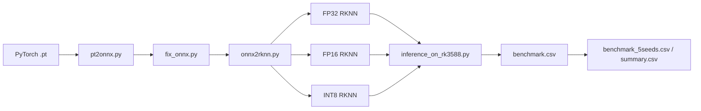

# RKNN 部署与评测指南

> 面向 `IQFormerLite` / `IQFormer` 在 Rockchip NPU（重点为 `RK3588`）上的模型转换、板端推理与多次评测。

## ✨ 这份 README 能帮你做什么

- 快速找到 `IQFormerLite` 和 `IQFormer` 的 RKNN 入口
- 按当前 `conda` 环境写清楚依赖版本
- 直接复制命令完成 Quickstart、单次推理、5 seeds 评测
- 理清 `PT -> ONNX -> RKNN -> 板端 benchmark` 的完整链路

## 🗺️ 总览图



## 📁 目录结构

```text
rknn/
├── README.md
├── README_CN.md
├── environment.yml                   # 完整 conda 环境导出
├── environment-min.yml               # 精简版 conda 环境导出
├── env_rknn_runtime_2.3.2.sh          # 配置 RKNN Runtime 动态库
├── rknn-explicit.txt                 # 显式包清单，适合同平台严格复现
├── run_benchmark_5seeds.py            # 统一跑 5 seeds 评测
├── runtime/
│   └── lib/
│       └── librknnrt.so
├── rknn_IQFormerLite/
│   ├── inference_on_rk3588.py
│   ├── inference_on_rk3588.sh
│   ├── benchmark.csv
│   ├── benchmark_5seeds.csv
│   ├── benchmark_5seeds_summary.csv
│   ├── calib/
│   │   └── dataset.txt
│   ├── pt2rknn/
│   │   ├── pt2onnx.py
│   │   ├── fix_onnx.py
│   │   ├── onnx2rknn.py
│   │   └── run_convert.sh
│   └── weights/
│       ├── IQFormerLite.pt
│       ├── weight_fp32.rknn
│       ├── weight_fp16.rknn
│       └── weight_int8.rknn
└── rknn_IQFormer/
    ├── inference_on_rk3588.py
    ├── inference_on_rk3588.sh
    ├── benchmark.csv
    ├── benchmark_5seeds.csv
    ├── benchmark_5seeds_summary.csv
    ├── calib/
    │   └── dataset.txt
    ├── pt2rknn/
    │   ├── pt2onnx.py
    │   ├── fix_onnx.py
    │   ├── onnx2rknn.py
    │   └── run_convert.sh
    └── weights/
        └── IQFormer/
            ├── IQFormer_fp32.rknn
            ├── IQFormer_fp16.rknn
            └── IQFormer_int8.rknn
```

## 🧪 环境版本

以下版本基于当前机器上的 `conda` 环境 `rknn` 与仓库内 Runtime 文件整理：

| 组件                   | 版本             | 说明                                                            |
| -------------------- | -------------- | ------------------------------------------------------------- |
| Conda env            | `rknn`         | 统一用于 RKNN 推理与转换脚本                                             |
| Python               | `3.10.20`      | 来自 `conda-meta/history`                                       |
| RKNN Runtime         | `2.3.2`        | 由 `env_rknn_runtime_2.3.2.sh` 与 `runtime/lib/librknnrt.so` 对应 |
| `rknn_toolkit_lite2` | `2.3.2`        | 板端推理脚本实际依赖                                                    |
| `numpy`              | `2.2.6`        | 评测与数据处理                                                       |
| `psutil`             | `7.2.2`        | 进程内存统计                                                        |
| `torch`              | `2.12.1+cu130` | CPU 侧复杂度/对照推理、导出 ONNX                                         |
| `einops`             | `0.8.2`        | 模型依赖                                                          |
| `timm`               | `1.0.27`       | 模型依赖                                                          |

> 提示
>
> - 板端推理已明确依赖 `rknn_toolkit_lite2==2.3.2`
> - `PT/ONNX -> RKNN` 转换脚本依赖 `rknn_toolkit2`（`from rknn.api import RKNN`），建议与 Runtime/Lite2 保持同版本 `2.3.2`
> - 如果你要在另一台机器复现，优先保证 `RKNN Runtime`、`rknn_toolkit_lite2`、`rknn_toolkit2` 三者版本一致

## ♻️ 环境复现

本目录已经提供 3 种环境复现方式，建议按需求选择：

### 方式 1：使用完整环境文件

适合大多数场景，优先推荐。

```bash
cd /home/orangepi/IQFormerLite
conda env create -f /home/orangepi/IQFormerLite/rknn/environment.yml
conda activate rknn
source /home/orangepi/IQFormerLite/rknn/env_rknn_runtime_2.3.2.sh
```

### 方式 2：使用精简环境文件

适合想减少冗余依赖、手动补装 RKNN 相关包的场景。

```bash
cd /home/orangepi/IQFormerLite
conda env create -f /home/orangepi/IQFormerLite/rknn/environment-min.yml
conda activate rknn
```

### 方式 3：使用显式清单严格复现

适合同平台严格复现，通常要求对方也是相同系统与架构。

```bash
conda create -n rknn --file /home/orangepi/IQFormerLite/rknn/rknn-explicit.txt
conda activate rknn
source /home/orangepi/IQFormerLite/rknn/env_rknn_runtime_2.3.2.sh
```

### 复现建议

- 推荐平台：`Linux aarch64`
- 推荐 Python：`3.10`
- 建议保持 `RKNN Runtime 2.3.2`、`rknn_toolkit_lite2 2.3.2`、`rknn_toolkit2 2.3.2` 一致
- 如果对方不是同架构机器，优先参考 `environment-min.yml` 再手动补齐 RKNN 相关依赖
- 如果存在本地 wheel、私有包或额外 `.so` 文件，需要一起分发

### 复现注意事项

- 如果对方不是 `Linux aarch64`，不要优先使用 `rknn-explicit.txt`
- 如果对方机器的 NPU Runtime 不同，板端推理可能失败
- 如果转换脚本报 `from rknn.api import RKNN` 错误，通常说明缺少 `rknn_toolkit2`
- 如果推理脚本报 `rknn_toolkit_lite2 not found`，通常说明当前环境未激活或 Lite2 未安装
- 如果报 `Missing librknnrt.so`，重新执行 `source /home/orangepi/IQFormerLite/rknn/env_rknn_runtime_2.3.2.sh`

### 快速自检

```bash
python -c "from rknnlite.api import RKNNLite; print('Lite2 OK')"
python -c "import numpy, torch, einops, timm, psutil; print('Python deps OK')"
source /home/orangepi/IQFormerLite/rknn/env_rknn_runtime_2.3.2.sh
```

## 🚀 Quickstart

### 1. 激活环境

```bash
cd /home/orangepi/IQFormerLite
conda activate rknn
source /home/orangepi/IQFormerLite/rknn/env_rknn_runtime_2.3.2.sh
```

运行成功后应能看到类似输出：

```text
Using RKNN runtime: /home/orangepi/IQFormerLite/rknn/runtime/lib/librknnrt.so
```

### 2. 开启 NPU 负载可读权限

如果你想在结果里看到 `npu_load_mean` / `npu_load_max`，先执行：

```bash
sudo chmod a+rx /sys/kernel/debug
sudo chmod a+rx /sys/kernel/debug/rknpu
sudo chmod a+r /sys/kernel/debug/rknpu/load
```

### 3. 一键跑 IQFormerLite

```bash
bash /home/orangepi/IQFormerLite/rknn/rknn_IQFormerLite/inference_on_rk3588.sh
```

输出文件默认写到：

```text
/home/orangepi/IQFormerLite/rknn/rknn_IQFormerLite/benchmark.csv
```

### 4. 一键跑 IQFormer

```bash
bash /home/orangepi/IQFormerLite/rknn/rknn_IQFormer/inference_on_rk3588.sh
```

输出文件默认写到：

```text
/home/orangepi/IQFormerLite/rknn/rknn_IQFormer/benchmark.csv
```

### 5. 跑 5 seeds 汇总评测

这个脚本会分别调用两个子目录里的 `inference_on_rk3588.py`，最终输出每个 seed 的结果和统计摘要。

```bash
PYTHONNOUSERSITE=1 /home/orangepi/miniconda3/envs/rknn/bin/python \
  /home/orangepi/IQFormerLite/rknn/run_benchmark_5seeds.py \
  --projects rknn_IQFormerLite rknn_IQFormer \
  --database_choose 2016.10a \
  --data /home/orangepi/IQFormerLite/dataset/RML2016.10a.pkl \
  --batch_size 16 \
  --seeds 1 2 3 4 5 \
  --split_random_state 233
```

生成结果：

- `rknn/rknn_IQFormerLite/benchmark_5seeds.csv`
- `rknn/rknn_IQFormerLite/benchmark_5seeds_summary.csv`
- `rknn/rknn_IQFormer/benchmark_5seeds.csv`
- `rknn/rknn_IQFormer/benchmark_5seeds_summary.csv`

## 🔧 从 PT 转到 RKNN

### 转换链路

```text
.pt  ->  pt2onnx.py  ->  .onnx
      ->  fix_onnx.py ->  *_fixed.onnx
      ->  onnx2rknn.py -> fp32 / fp16 / int8 .rknn
```

### IQFormerLite 转换示例

```bash
bash /home/orangepi/IQFormerLite/rknn/rknn_IQFormerLite/pt2rknn/run_convert.sh \
  -m /path/to/IQFormerLite.pt \
  --database 2016.10a \
  --dataset /home/orangepi/IQFormerLite/rknn/rknn_IQFormerLite/calib/dataset.txt
```

转换后默认会在模型所在目录生成：

- `*_fp32.rknn`
- `*_fp16.rknn`
- `*_int8.rknn`

### IQFormer 转换示例

```bash
bash /home/orangepi/IQFormerLite/rknn/rknn_IQFormer/pt2rknn/run_convert.sh \
  -m /path/to/IQFormer.pt \
  --database 2016.10a \
  --dataset /home/orangepi/IQFormerLite/rknn/rknn_IQFormer/calib/dataset.txt
```

### 关于 INT8 校准

- `INT8` 转换需要 `dataset.txt`
- `dataset.txt` 中应列出校准样本路径
- `IQFormer` 的转换脚本会优先使用 `calib/dataset.txt`
- 如果 `dataset.txt` 不存在，`IQFormer` 脚本会尝试从 `calib/` 下的 `iq_*.npy` 自动生成列表

## 🧭 常用命令

### 只跑指定目录下的 RKNN 模型

```bash
PYTHONNOUSERSITE=1 /home/orangepi/miniconda3/envs/rknn/bin/python \
  /home/orangepi/IQFormerLite/rknn/rknn_IQFormerLite/inference_on_rk3588.py \
  --models_dir /home/orangepi/IQFormerLite/rknn/rknn_IQFormerLite/weights \
  --output_csv /home/orangepi/IQFormerLite/rknn/rknn_IQFormerLite/benchmark.csv \
  --data /home/orangepi/IQFormerLite/dataset/RML2016.10a.pkl \
  --database_choose 2016.10a \
  --batch_size 16 \
  --seed 1
```

### 只评测 IQFormer

```bash
PYTHONNOUSERSITE=1 /home/orangepi/miniconda3/envs/rknn/bin/python \
  /home/orangepi/IQFormerLite/rknn/run_benchmark_5seeds.py \
  --projects rknn_IQFormer \
  --database_choose 2016.10a \
  --data /home/orangepi/IQFormerLite/dataset/RML2016.10a.pkl
```

## 📊 输出字段说明

- `params_m` / `flops_g` / `cpu_model_size_kb`：CPU 侧模型复杂度
- `rknn_model_size_kb`：RKNN 文件大小
- `cpu_latency_ms` / `cpu_throughput`：CPU 侧动态性能
- `npu_latency_batch_ms` / `npu_latency_sample_ms` / `npu_throughput`：NPU 侧动态性能
- `npu_accuracy`：NPU 侧精度
- `speedup`：CPU / NPU 延迟比
- `npu_load_mean` / `npu_load_max`：NPU 负载
- `memory_baseline_mb` / `memory_peak_mb` / `memory_delta_mb`：进程 RSS 基线/峰值/增量

## ❗ 常见问题

### 1. 提示 `rknn_toolkit_lite2 not found`

说明当前没有激活 `rknn` 环境，或者环境里没装 Lite2：

```bash
conda activate rknn
python -c "from rknnlite.api import RKNNLite; print('OK')"
```

### 2. 提示 `Missing librknnrt.so`

先确认 Runtime 文件存在，再重新 `source`：

```bash
ls /home/orangepi/IQFormerLite/rknn/runtime/lib/librknnrt.so
source /home/orangepi/IQFormerLite/rknn/env_rknn_runtime_2.3.2.sh
```

### 3. `npu_load_mean` / `npu_load_max` 为空

通常是 `/sys/kernel/debug/rknpu/load` 没有读取权限，执行：

```bash
sudo chmod a+rx /sys/kernel/debug
sudo chmod a+rx /sys/kernel/debug/rknpu
sudo chmod a+r /sys/kernel/debug/rknpu/load
```

### 4. 转换时报 `from rknn.api import RKNN` 失败

这类问题通常不是板端 Runtime，而是转换环境缺少 `rknn_toolkit2`。建议在 `rknn` 环境中补齐，并与 `Lite2 / Runtime 2.3.2` 保持一致。

## 📌 你最可能会用到的入口

- 跑 `IQFormerLite`：`rknn/rknn_IQFormerLite/inference_on_rk3588.sh`
- 跑 `IQFormer`：`rknn/rknn_IQFormer/inference_on_rk3588.sh`
- 跑 5 seeds 汇总：`rknn/run_benchmark_5seeds.py`
- 转换 `IQFormerLite`：`rknn/rknn_IQFormerLite/pt2rknn/run_convert.sh`
- 转换 `IQFormer`：`rknn/rknn_IQFormer/pt2rknn/run_convert.sh`

***
